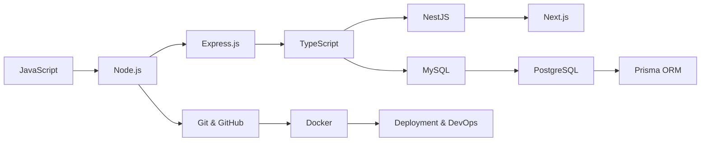

# 👋 Hi, I'm Jhon Mario

Backend Developer focused on the **JavaScript ecosystem**, building scalable and maintainable systems.

I’m currently in a learning-to-production phase, strengthening my backend engineering skills by building real projects, collaborating on systems, and gradually moving toward production-ready architecture.

I’ve successfully shipped a public personal finance manager (**[TrackFinan](https://github.com/JhonMarioA/TrackFinanr)**) and I’m currently improving it with new features and better backend architecture. In parallel, I maintain several private mini-projects focused on experimenting with backend design patterns, APIs, and system-level thinking before production use.

 

## Current Focus

- Building my personal CRM project: **CiRoM**
- Collaborating on a **programming judge platform**, focusing on backend development with **Node.js** (**[Judge-Backend](https://github.com/Backbone-UTP/judge-backend)**)
- Deepening my knowledge in **TypeScript** for scalable backend systems
- Exploring **NestJS** as my main backend framework
- Strengthening backend architecture, APIs, and system design fundamentals
- Preparing to move into **deployment & production workflows**

 

## Collaboration

### Programming Judge Platform (Backend Contributor)

I’m currently collaborating on a programming judge system, where my main focus is backend development.

- Backend built on **Node.js**
- API design and system logic
- Focus on problem execution flow and evaluation architecture
- Preparing structure for scalability and modular design

This experience is helping me understand real-world backend systems beyond personal projects.

 

## Learning Roadmap

 

##  What I Know / What I'm Learning

### Already familiar with:

- JavaScript (core concepts, async, APIs, event loop)
- Node.js
- Express.js
- MySQL
- Git & GitHub
- Docker basics 

### Currently learning:

- TypeScript (strong typing, interfaces, generics, OOP patterns)
- NestJS (modules, dependency injection, architecture patterns)
- Next in my roadmap:
  - Next.js (fullstack JavaScript ecosystem)
  - PostgreSQL + Prisma ORM
  - Docker (deeper backend usage)
- Deployment (Render, VPS, CI/CD pipelines)
- What I Care About
  - Writing clean, scalable backend systems
  - Understanding how production-grade software is structured
  - Building real-world systems
  - Mastering the JavaScript ecosystem end-to-end
  - Continuous improvement through hands-on engineering

 

## Tech Stack

### Languages

### Backend

### Frontend

### Databases

### Tools & DevOps

 

## Featured Projects
### CiRoM — CRM System (in progress)

A backend-focused CRM system designed to practice real-world architecture and scalable system design.

- Modular architecture (NestJS-based)
- Authentication & user management (in progress)
- API-first backend design
- Focus on scalability, maintainability, and clean structure

### Backend contributor in a programming judge system.

- Problem execution backend logic
- System architecture and API design
- Preparing scalable backend modules
- Focus on performance and maintainability

 

  
  

## Note

This profile represents my journey as a backend developer focused on mastering the JavaScript ecosystem from fundamentals to production-level systems, while actively contributing to real-world projects.

 

## Contact

- LinkedIn: *https://www.linkedin.com/in/jhon-mario-aguirre-correa-457370378/*
- Email: *jhon.aguirre1@utp.edu.co*